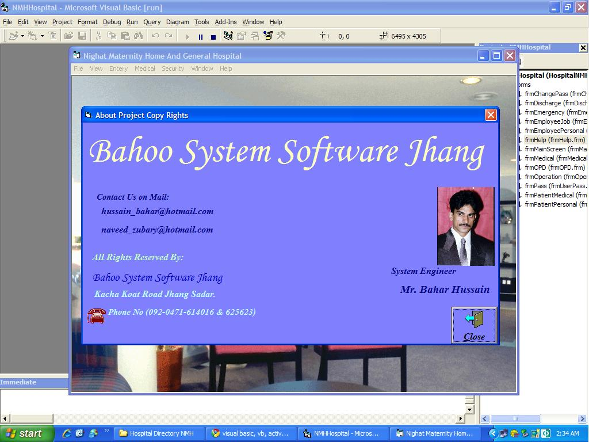



## Night Maternity General Hospital \<\<System\>\>

### Description

THIS SOFTWARE IS CREATED FOR MANAGING ALL THE PURPOSES OF:

<<NIGHT MATERNITY HOME AND GENERAL HOSPITAL>>

PRODUCER:

<<BAHOO SOFTWARES JHANG SADDAR>>
 
### More Info
 

             |
---                |---
**Submitted On**   |2010-05-22 02:44:22
**By**             |[HAmza ChohAn](https://github.com/Planet-Source-Code/PSCIndex/blob/master/ByAuthor/hamza-chohan.md)
**Level**          |Beginner
**User Rating**    |3.7 (11 globes from 3 users)
**Compatibility**  |VB 3\.0, VB 4\.0 \(16\-bit\), VB 4\.0 \(32\-bit\), VB 5\.0, VB 6\.0
**Category**       |[Complete Applications](https://github.com/Planet-Source-Code/PSCIndex/blob/master/ByCategory/complete-applications__1-27.md)
**World**          |[Visual Basic](https://github.com/Planet-Source-Code/PSCIndex/blob/master/ByWorld/visual-basic.md)
**Archive File**   |[Night\_Mate2181535222010\.zip](https://github.com/Planet-Source-Code/hamza-chohan-night-maternity-general-hospital-system__1-73168/archive/master.zip)

